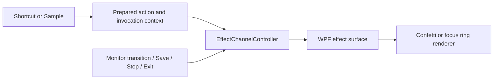

# drawEM v4 roadmap: built-in screen effects

**Status:** proposed product and implementation plan; not implemented.
**Date:** 2026-10-07.
**Prerequisite for release:** finish the v3 Step 8 Windows acceptance work.
Its task file records verification on one 100% monitor, with seven
environment-dependent checks still unverified. Planning and the rendering
experiment can proceed now.

## Product decision

Add short animated effects over the desktop, triggered from the existing eight
action slots. The user confirmed two boundaries for the first release:

- Built-in effects only; imported video comes later.
- Moving the cursor to another monitor stops the running effect.

The remaining choices below are proposed defaults. They make the first release
implementable without an animation editor, new media dependencies, or a new
shortcut system.

### First experience

1. Open Settings > Actions and select a slot.
2. Choose Sound or Effect. For Effect, select a built-in preset.
3. Assign a shortcut and press Sample to see the draft effect on the monitor
   containing the cursor, at its normal desktop size.
4. Save. Pressing the shortcut while another application has focus starts the effect.

Keep eight slots shared by sound and effects. Drawing and clear retain their
separate bindings. A slot has exactly one action; a shortcut does not launch a
sound and effect together. A separately triggered sound may run alongside an effect.

### Initial presets

| Preset | Purpose | Proposed behavior |
|---|---|---|
| Confetti | Celebrate during a presentation or demonstration | One burst across the active monitor, fading out within 3 seconds; silent |
| Focus ring | Draw attention to a location | A ring expands and fades around the cursor position captured at invocation, ending within 2 seconds; silent |

The focus ring stays at its initial position; it does not follow the cursor.
Both effects use a transparent monitor-sized surface, have no rapid flashing,
and finish without user input. Ship fixed presets first: no color, duration,
intensity, particle-count, or placement controls. Preset choice remains a
product decision that can change before implementation.

### Playback contract

| Event | Result |
|---|---|
| First shortcut press | Start once on the monitor containing the cursor at invocation |
| Shortcut held | No repeat |
| Same effect pressed again after release | Stop the old instance and restart from the beginning |
| Different effect invoked | Replace the current effect; no queue or crossfade |
| Cursor moves within that monitor | Continue |
| Cursor enters another connected monitor | Stop; do not restart when the cursor returns |
| Cursor reaches the outside edge of the desktop | Continue; an outside edge is not another monitor |
| Effect completes | Remove its visuals and release its animation subscription |
| Tray > Stop effects | Stop the active effect, including a Sample; leave sound and drawings alone |
| Settings Save succeeds | Stop effects and sound, exit drawing, clear strokes, then publish new bindings |
| Settings validation or persistence fails | Keep the previous active configuration and running actions |
| Settings Cancel/close | Stop only the draft's current Sample, if it still owns that instance |
| Display topology changes, session locks, or system suspends | Stop the effect; do not resume it automatically |
| App exits | Stop effects, remove surfaces, release resources |

One effect channel belongs to each monitor conceptually. Under SINGLE_SCREEN,
at most one effect is active across the application: crossing monitors stops
the old one. Do not implement a collection of independently running channels
until MULTIPLE_SCREEN behavior has a product contract.

Drawing, effects, and global sound remain independent. Effects appear above
drawings; starting/stopping an effect does not clear strokes or end a stroke.
Clear continues to clear drawings only. Keyboard and pointer input pass
through during effects, except for assigned shortcut suppression and existing
drawing-mode input blocking. Effects never take focus or appear in Alt+Tab.

Sample uses the same effect channel, replacement rules, and monitor policy as
shortcuts, without changing saved assignments. Settings stays open and keeps
focus. The mouse is usually over the Sample button, so that monitor is the
target; this limitation is deliberate. A new Sample or shortcut replaces an
older Sample. Closing its old editor must not stop the replacement.

## Current implementation and required changes

Inspected in this worktree on 2026-10-07:

| Existing owner | Current behavior | Required extension |
|---|---|---|
| `Domain/Settings/ActionSlot.cs` | `SlotAction` with `SoundAction` | Add a typed `EffectAction` with a stable preset ID |
| `Domain/Settings/SettingsSnapshot.cs` | Common shortcut validation, sound-specific payload validation | Validate effect IDs and reject unsupported action payloads |
| `Application/Settings/ActiveSettings.cs` | Builds sound commands from managed references | Prepare typed sound/effect commands from one snapshot |
| `Infrastructure/Drawing/ShortcutBindings.cs` | Builds bindings only from `SoundAction` | Bind all supported slot types without silently dropping effects |
| `Infrastructure/Drawing/GlobalShortcutAdapter.cs` | Dispatches prepared sound commands; owns key/capture behavior | Dispatch typed slot commands, preserving suppression and release bookkeeping |
| `Infrastructure/Drawing/GlobalMouseInputAdapter.cs` | Reports movement to drawing when draw mode is active | Observe monitor transitions independently of drawing |
| `Presentation/Drawing/OverlayWindow.xaml.cs` | One transparent window spanning the virtual desktop | Add a dedicated effect surface sized to the target monitor |
| `Application/Settings/SettingsEditor.cs` | Sound selection, sampling, Save/Cancel ownership | Effect selection and sample-instance ownership |
| `Application/Settings/SettingsSaveOperation.cs` | Durable Save and sound/drawing interruption | Invalidate queued effect starts and stop visible effects on successful Save |
| `Infrastructure/Settings/SettingsJson.cs` | Schema 1, sound discriminator only | Schema 2, effect discriminator, schema 1 migration |
| `App.xaml.cs`, tray/lifecycle adapters | Compose drawing, sound, and settings | Compose effect runtime, Stop effects, and cleanup |

Paths in this table are relative to `src/DrawEM.App/`.

## Technical design

### Domain and application ownership

- **Effect preset:** a built-in animation definition identified by a stable ID,
  initially `confetti` or `focus-ring`. Display names may change without changing IDs.
- **Effect action:** a slot assignment selecting a preset and a shortcut.
- **Effect instance:** one invocation, including its unique identity, target
  monitor, starting cursor position, configuration generation, and start time.
- **Effect channel:** the owner that replaces, completes, or cancels instances.

Keep these definitions in this proposal until accepted. Domain types contain
no WPF visuals, native window handles, file paths, or rendering callbacks.

Use an `EffectChannelController` in `Application/Effects` to own a small state
machine: Idle -> Running(instance) -> Idle. Replacement ends the old instance
before starting the next. Inject a clock and a presentation port such as
`IEffectSurface`; use fake ports for lifecycle tests. An adapter maps application
monitor identities and physical coordinates to WPF/Win32 resources.

Renderers belong in `Presentation/Effects`; Win32 display/session adapters
belong in Infrastructure. A small built-in catalog supplies preset metadata.
Use explicit dispatch for Sound and Effect. Do not introduce a plugin loader,
script runtime, event bus, or generic multimedia engine for these two types.



### Renderer recommendation and decision gate

Start with WPF, matching the existing application. Use a monitor-sized,
transparent, nonactivating effect window above the drawing overlay. Make its
native input behavior pass through to applications in other processes; do not
assume `IsHitTestVisible=false` alone establishes desktop click-through.
Verify window ordering, focus, task switching, and input on real Windows.

Draw particles/rings through a lightweight drawing element or DrawingVisual.
Avoid one WPF control per particle and avoid triggering layout every frame.
Use `CompositionTarget.Rendering` while an effect is active and unsubscribe on
every stop/failure path. Calculate progress from monotonic elapsed time, so a
slow frame does not lengthen the effect. Cap particles, reuse storage, and
avoid per-frame allocations. Enforce a 10-second maximum instance lifetime
even if a preset fails to report completion.

Microsoft documents a per-frame rendering callback and notes that WPF rendering
cost grows with the number of pixels rendered. These support testing a bounded
surface and a small renderer; they do not prove acceptable performance on the
target desktop. See [per-frame rendering](https://learn.microsoft.com/en-us/dotnet/desktop/wpf/graphics-multimedia/how-to-render-on-a-per-frame-interval-using-compositiontarget)
and [WPF hardware performance](https://learn.microsoft.com/en-us/dotnet/desktop/wpf/advanced/optimizing-performance-taking-advantage-of-hardware).

Preserve physical monitor bounds and convert to the effect window's local DIPs
using that window's transform. Clip at monitor edges. Size the focus ring in
DIPs for consistent perceived size; size the confetti field relative to monitor
dimensions. Exercise negative desktop coordinates and 100%/150%/200% scaling.
Keep the existing drawing renderer unchanged unless the experiment exposes a
specific shared-window defect that needs a separately scoped fix.

Compare these options in S4-01:

| Option | Benefit | Cost / decision |
|---|---|---|
| Dedicated WPF effect surface | Existing stack; isolates effect rendering and target-monitor sizing | Recommended; must prove ordering, click-through, and frame pacing |
| Add effects to the virtual-desktop drawing window | Fewer windows | Couples animation cost and DPI handling to the entire desktop; fallback only with evidence |
| DirectComposition/Direct2D adapter | Alternative if WPF misses measured requirements | Additional native interop and lifecycle work; investigate only if the WPF experiment fails |

If WPF fails, record the measurements and a renderer decision before expanding
implementation. Timebox each fallback proof to two working days and escalate to
the drawEM project owner when the limit is reached. If no option meets the
criteria, stop and revise thresholds or scope before S4-02. Do not ship a new
renderer based only on a theoretical advantage.

### Input ordering and interruption

The hook continues doing bounded input work only: recognize the shortcut,
decide suppression, capture cursor position, and enqueue a prepared invocation.
No file access, animation work, or window creation occurs in the hook callback.
Resolve the captured point against monitor topology outside the hook; do not
resample the cursor later and accidentally target another monitor.

Observe pointer transitions even when drawing is inactive and an effect is
running or queued. Do only a cached-bounds check in the hook; send work to the
dispatcher on a transition, not on every pointer move. Check the current
cursor position again during active animation frames as a backstop for movement
the hook did not report. Preserve transition
order or a monotonic monitor epoch: coalescing away an A -> B -> A transition
must not let the original effect survive. Associate queued starts with the
configuration and monitor epoch; discard requests invalidated before dispatch.
No target monitor means no start. Use monitor identity plus topology generation,
not only a rectangle, and stop/rebuild surfaces when topology changes. Build
the identity, generation, and display-change handling in S4-07, before the
final lifecycle wiring in S4-11.

The current low-level hooks also run on the UI thread. S4-01 must measure hook
delivery delay while effects animate, including while drawing, to protect
shortcut and input responsiveness. If WPF animation overloads that thread,
evaluate a separate effect UI thread or renderer before S4-02.

Run controller transitions and WPF rendering on the UI dispatcher only if that
experiment passes. Completion,
deadline, and Sample cancellation carry instance IDs; an old callback cannot
stop a replacement. Serialize the final validity check with visual publication
on that dispatcher. A generation check detached from publication is insufficient.

On Save, retain the current sound start-hold protocol. Once persistence succeeds,
invalidate earlier effect requests and stop the surface before publishing the
new snapshot/bindings. No earlier queued invocation may appear afterwards.
Handle rendering failures locally: clear partial visuals, detach callbacks, log
the failure, and show Sample errors in Settings without crashing drawing/audio.

### Settings and persistence

Add an action-type selector and preset selector in each existing Actions row.
Changing type preserves that row's shortcut; filling an empty slot proposes its
existing `Ctrl+Alt+N` default. Clear removes the action and binding. Type changes
remain drafts until Save. Sample works with a selected preset even if its draft
shortcut is missing or conflicts; Save still requires all bindings to be valid.

Schema 2 retains the slot shape and adds an effect payload:

```json
{ "slot": 2, "action": { "type": "effect", "effectId": "confetti", "shortcut": "Ctrl+Alt+2" } }
```

Read schema 1 into the new model without modifying its sounds, shortcuts, or
files. Every v4 Save writes schema 2, including when all slots contain only
sounds. Before the first such Save, make one immutable backup of the current
schema 1 file; never overwrite an existing migration backup on later upgrades.
If backup creation fails, do not save. An older binary cannot read schema 2,
so rollback requires restoring the backup while drawEM is closed. The backup
does not restore sound copies deleted by later saves or sounds imported after
the backup; the older app's startup cleanup may also remove copies not named
by restored settings. Document these limits.

Effect Sample cancellation is instance-scoped. The existing sound sampler
stops the global sound channel on Cancel; aligning that behavior is a separate
sound task, outside this roadmap.

Reject unknown action types and effect IDs with a useful error; retain the
existing unreadable-file preservation and skip-cleanup behavior. Do not silently
turn an unsupported action into an empty slot. Effects own no managed media.
Sound garbage collection must still count every saved SoundAction reference,
including when a draft changes a sound slot to an effect and is then cancelled.

## Delivery order and completion criteria

Follow the [simple implementation steps](STEPS.md). Each step has one outcome
and a completion check. These twelve proposed task IDs replace the original
six broad planning tasks; only S4-01 is recorded as complete, by owner decision.

| Task | Outcome |
|---|---|
| [S4-01](step-01-effect-surface/task.md) | Prove a transparent effect window works on Windows |
| [S4-02](step-02-effect-channel/task.md) | Start, replace, and stop one effect safely |
| [S4-03](step-03-built-in-effects/task.md) | Render confetti and a focus ring |
| [S4-04](step-04-effect-action-model/task.md) | Represent an effect in an action slot |
| [S4-05](step-05-effect-settings-schema/task.md) | Save and load effect assignments |
| [S4-06](step-06-effect-shortcuts/task.md) | Launch effects through shortcuts |
| [S4-07](step-07-effect-monitor-transitions/task.md) | Stop effects when switching monitors |
| [S4-08](step-08-effect-settings-ui/task.md) | Choose effects in Settings |
| [S4-09](step-09-effect-sample/task.md) | Preview draft effects with Sample |
| [S4-10](step-10-effect-save-runtime/task.md) | Apply settings without leaving an old effect running |
| [S4-11](step-11-effect-lifecycle/task.md) | Stop and clean up effects through the app lifecycle |
| [S4-12](step-12-effect-publish/task.md) | Publish and verify on Windows |

Work in this order. Basic resource cleanup belongs to S4-02/S4-03; S4-11 connects
the remaining application events. Release also depends on the v3 baseline.

The overall planning estimate remains approximately 7-11 engineering days for
one developer if WPF passes S4-01. S4-01 takes an estimated 1-2 days. Re-estimate
after that experiment; renderer replacement is outside this estimate.

## Acceptance strategy

Automated tests should establish domain validation, migration, ownership, and
ordering using fake clocks/surfaces and existing hook test seams. Cover:

- Restart/replacement, completion, the lifetime cap, and obsolete callbacks.
- A -> B -> A movement, movement with no drawing, outside edges, and topology changes.
- Save failure, successful Save with a queued invocation, and Stop before dispatch.
- Sample -> shortcut -> old editor Cancel; Sample -> Sample replacement.
- Sound -> Effect draft -> Cancel preserving saved audio and managed copies.
- Existing AltGr rejection, capture mode, key-up suppression, and layout protection.

Published-app checks must separately establish visible rendering, input behavior,
and performance. Exercise one monitor and two mixed-DPI monitors, negative
coordinates, drawing plus effects plus sound, Settings Sample, task switching,
disconnect/reconnect, lock/unlock, suspend/resume, and exit during animation.
Check effects in a full-display screen share from a second receiving device;
record window-only sharing separately, without promising that it includes an
independent overlay window.

Proposed release targets, measured on a recorded reference PC: effect first
appearance within 100 ms at p95 over 100 warm shortcut invocations. Start at
the hook event timestamp and end at the first presented frame containing effect
pixels. Record the screen-capture or presentation-timing method and its error.
S4-01 uses a temporary trigger and gives only a renderer estimate; S4-12
measures the full shortcut path. Effect render callback time stays within 4 ms
at p95. Hook event-to-callback delay during animation and active drawing stays
within 25 ms at p95 and 100 ms maximum; verify the hooks still function after
100 cycles. Visual inspection/recording shows no sustained animation stutter
or drawing slowdown. Callback timing alone does not prove displayed frame rate.
Record cold starts separately. After 100
restart/replacement cycles and return to idle, no live effect instances,
animation subscriptions, or growing window/handle counts remain. Record CPU,
GPU, memory, monitor resolution/scaling, build hash, and measurement method.
Threshold changes require an explicit rationale in the experiment report.

## Later phase: imported video

Video is outside the first effects release. Keep a future `VideoAction` distinct
from `EffectAction`: video references an imported media file; effects select
built-in code. Add a separate video channel with its own playback lifecycle.
The existing architecture proposal permits effects over video, and video audio
ends with its video while the global sound channel remains independent.

Before scheduling video work:

1. Choose opaque full-monitor clips versus transparent animated stickers.
   These have different decoder/compositor requirements. Also decide aspect-fit
   behavior, embedded audio controls, duration limits, and accepted formats.
2. Prove the chosen formats in the actual overlay. WPF offers MediaPlayer with
   VideoDrawing, but that API's existence does not establish alpha-video support,
   codec availability, or acceptable overlay performance on target machines.
   See [Microsoft's VideoDrawing example](https://learn.microsoft.com/en-us/dotnet/desktop/wpf/graphics-multimedia/how-to-play-media-using-a-videodrawing).
3. Design video import, bounded validation/decode failure handling, managed-file
   lifetime, and settings migration. Evaluate native dependencies only against
   the chosen formats and measured renderer limits.
4. Define and verify cross-window layering before implementing playback. The
   intended order is desktop -> video -> drawings -> effects. Effects-only v4
   does not establish this future composition path.
5. Deliver video as a separate roadmap with codec fixtures, embedded-audio
   checks, media cleanup, stale-open cancellation, and published-app acceptance.

Deferred beyond this plan: video import, GIF/WebM/Lottie import, editable effect
parameters, action sequences combining sound and effects, effect marketplaces,
third-party plugins, and simultaneous effects across monitors.

## Related plans

- [v3 settings roadmap](../v3/ROADMAP-v3.md)
- [v3 Windows publish and verification](../v3/step-8-publish/task.md)
- [Existing screen-action architecture proposal](../ARCHITECTURE.md#proposed-evolution-screen-actions)
- [v2 sound and microphone roadmap](../v2/ROADMAP-v2.md)

This document specifies proposed work. No effect renderer, performance results,
or desktop acceptance is claimed by writing this plan.
