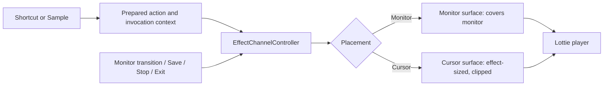

# drawEM v4 roadmap: built-in Monitor and Cursor effects

**Status:** proposed product and implementation plan. S4-01 is done by owner
decision with its measurement gates unverified; later steps are pending.
**Date:** 2026-10-07; revised 2026-10-09 for Lottie effects with two placements.
**Prerequisite for release:** finish the v3 Step 8 Windows acceptance work.
Its task file records verification on one 100% monitor, with seven
environment-dependent checks still unverified.
**Terms:** [glossary](../../CONTEXT.md). **Decision:** [ADR 0001](../adr/0001-lottie-built-in-effects.md).

## Product decision

Add short animated effects over the desktop, triggered from the existing eight
action slots. The project owner confirmed these boundaries for the first release:

- Built-in effects only. The drawEM team authors them in a visual animation
  editor, or selects existing animations, and ships them as Lottie files. Users do not import effects; imported
  effects and video come later.
- Every built-in effect has one fixed **Placement**:
  - **Monitor:** the effect covers the whole monitor.
  - **Cursor:** the effect has a fixed size and is centered on the cursor point
    captured at start.
- Moving the cursor to another monitor stops the running effect, for both placements.

### First experience

1. Open Settings > Actions and select a slot.
2. Choose Sound or Effect. For Effect, select a built-in effect. The list groups
   effects under **Monitor** and **Cursor**.
3. Assign a shortcut and press Sample to see the draft effect on the monitor
   containing the cursor, at its normal desktop size.
4. Save. Pressing the shortcut while another application has focus starts the effect.

Keep eight slots shared by sound and effects. Drawing and clear retain their
separate bindings. A slot has exactly one action; a shortcut does not launch a
sound and effect together. A separately triggered sound may run alongside an effect.
The user selects an effect, never a placement: placement belongs to the effect.

### Initial built-in effects

| Effect | Effect ID | Placement | Purpose | Behavior |
|---|---|---|---|---|
| Confetti | `confetti` | Monitor | Celebrate during a presentation or demonstration | One burst across the monitor, ending within 3 seconds; silent |
| Focus ring | `focus-ring` | Cursor | Draw attention to a location | A ring expands and fades around the captured cursor point, ending within 2 seconds; silent |

A Cursor effect stays at its captured point; it does not follow the cursor.
Both effects have no rapid flashing and finish without user input. Ship fixed
effects first: no color, duration, intensity, size, or placement controls.
The effect list can change before implementation without changing this design.

### Effect content rules

These rules apply to every built-in effect file:

| Rule | Monitor effect | Cursor effect |
|---|---|---|
| Size on screen | Covers the monitor: scale the Lottie canvas until it fills the monitor, keep its proportions, crop the overflow | The Lottie canvas size in DIP, scaled by the monitor's DPI |
| Position | Centered on the monitor | Centered on the cursor point captured at start |
| Monitor edge | Cropped to the monitor | Clipped at the monitor edge; never shifted inward |
| Designer guidance | Keep important content away from canvas edges; ultrawide and portrait monitors crop them | Keep the canvas tight around the visible animation; empty canvas costs render time |

For both placements:

- The Lottie file defines the length. The effect plays once and never loops.
- An automated test fails if any built-in effect is longer than 10 seconds or
  fails to load in the player. The controller's 10-second deadline remains a
  runtime safety net.
- The first files are selected from LottieFiles and adapted by the drawEM team
  where needed. Each file's source URL, author, and license are recorded beside
  it in the repository. Replacing a file changes no code.

### Playback contract

| Event | Result |
|---|---|
| First shortcut press | Start once on the monitor containing the cursor at invocation |
| Shortcut held | No repeat |
| Same effect pressed again after release | Stop the old instance and restart from the beginning |
| Different effect invoked, of either placement | Replace the current effect; no queue or crossfade |
| Cursor moves within that monitor | Continue; a Cursor effect stays at its captured point |
| Cursor enters another connected monitor | Stop; do not restart when the cursor returns |
| Cursor reaches the outside edge of the desktop | Continue; an outside edge is not another monitor |
| Effect completes | Remove its visuals and release its animation subscription |
| Tray > Stop effects | Stop the active effect, including a Sample; leave sound and drawings alone |
| Settings Save succeeds | Stop effects and sound, exit drawing, clear strokes, then publish new bindings |
| Settings validation or persistence fails | Keep the previous active configuration and running actions |
| Settings Cancel/close | Stop only the draft's current Sample, if it still owns that instance |
| Display topology changes, session locks, or system suspends | Stop the effect; do not resume it automatically |
| App exits | Stop effects, remove surfaces, release resources |

One effect channel serves both placements. Under SINGLE_SCREEN, at most one
effect is active across the application, whatever its placement: a Cursor
effect replaces a Monitor effect and the reverse. Do not implement independently
running channels until MULTIPLE_SCREEN behavior has a product contract.

Drawing, effects, and global sound remain independent. Effects appear above
drawings; starting/stopping an effect does not clear strokes or end a stroke.
Clear continues to clear drawings only. Keyboard and pointer input pass
through during effects, except for assigned shortcut suppression and existing
drawing-mode input blocking. Effects never take focus or appear in Alt+Tab.

Sample uses the same effect channel, replacement rules, and monitor policy as
shortcuts, without changing saved assignments. Settings stays open and keeps
focus. The mouse is usually over the Sample button, so that monitor is the
target and a Cursor effect appears around the button; this limitation is
deliberate. A new Sample or shortcut replaces an older Sample. Closing its old
editor must not stop the replacement.

## Current implementation and required changes

Inspected on 2026-10-07; S4-01 probe added on 2026-10-08:

| Existing owner | Current behavior | Required extension |
|---|---|---|
| `Domain/Settings/ActionSlot.cs` | `SlotAction` with `SoundAction` | Add a typed `EffectAction` with a stable effect ID |
| `Domain/Settings/SettingsSnapshot.cs` | Common shortcut validation, sound-specific payload validation | Validate effect IDs against the built-in catalog and reject unsupported payloads |
| `Application/Settings/ActiveSettings.cs` | Builds sound commands from managed references | Prepare typed sound/effect commands from one snapshot |
| `Infrastructure/Drawing/ShortcutBindings.cs` | Builds bindings only from `SoundAction` | Bind all supported slot types without silently dropping effects |
| `Infrastructure/Drawing/GlobalShortcutAdapter.cs` | Dispatches prepared sound commands; owns key/capture behavior | Dispatch typed slot commands, preserving suppression and release bookkeeping |
| `Infrastructure/Drawing/GlobalMouseInputAdapter.cs` | Reports movement to drawing when draw mode is active | Observe monitor transitions independently of drawing |
| `Presentation/Effects/EffectSurfaceWindow.cs` | S4-01 probe: monitor-sized, nonactivating, click-through window | Basis for both surfaces: Monitor surface covers the monitor; Cursor surface is sized to the effect and clipped to the monitor |
| `Presentation/Effects/EffectSurfaceProbe.cs` | Temporary probe behind `DRAWEM_EFFECT_PROBE=1` | Reused by the S4-03.1 Lottie speed gate; removed in S4-06 |
| `Application/Settings/SettingsEditor.cs` | Sound selection, sampling, Save/Cancel ownership | Effect selection grouped by placement and sample-instance ownership |
| `Application/Settings/SettingsSaveOperation.cs` | Durable Save and sound/drawing interruption | Invalidate queued effect starts and stop visible effects on successful Save |
| `Infrastructure/Settings/SettingsJson.cs` | Schema 1, sound discriminator only | Schema 2, effect discriminator, schema 1 migration |
| `App.xaml.cs`, tray/lifecycle adapters | Compose drawing, sound, and settings | Compose effect runtime, Stop effects, and cleanup |

Paths in this table are relative to `src/DrawEM.App/`.

## Technical design

### Domain and application ownership

Terms follow the [glossary](../../CONTEXT.md):

- **Built-in effect:** a catalog entry with a stable effect ID (`confetti`,
  `focus-ring`), a display name, a placement, and a Lottie resource. Display
  names and files may change without changing IDs.
- **Placement:** Monitor or Cursor; fixed per built-in effect.
- **Effect action:** a slot assignment selecting an effect ID and a shortcut.
  It does not store placement.
- **Effect instance:** one invocation, including its unique identity, effect ID,
  placement, target monitor, captured cursor point, configuration generation,
  and start time.
- **Effect channel:** the owner that replaces, completes, or cancels instances.

Domain types contain no WPF visuals, native window handles, file paths,
Lottie or Skia types, or rendering callbacks.

Use an `EffectChannelController` in `Application/Effects` to own a small state
machine: Idle -> Running(instance) -> Idle. Replacement ends the old instance
before starting the next, regardless of placement. Inject a clock and a
presentation port such as `IEffectSurface`; use fake ports for lifecycle tests.
The controller passes the instance's placement to the port; it does not branch
on placement itself.

The catalog lives in `Domain/Effects` as plain data: effect ID, display name,
placement, and resource name. Domain settings validation reads it directly,
which the layer rules allow; Application must not own it. Presentation maps the resource name to an
embedded Lottie file. Use explicit dispatch for Sound and Effect, and for
Monitor and Cursor. Do not introduce a plugin loader, script runtime, event bus,
or generic multimedia engine.



### Rendering

S4-01 chose a dedicated WPF effect surface: a transparent, nonactivating,
click-through window above the drawing overlay. Keep it. Both placements use
that window type with different bounds:

- **Monitor surface:** covers the target monitor. The player draws the Lottie
  canvas with cover scaling, centered.
- **Cursor surface:** sized to the Lottie canvas in DIP at the monitor's DPI,
  centered on the captured cursor point, then intersected with the monitor
  bounds. The intersection clips the effect; the window never extends onto a
  neighboring monitor. A small window renders far fewer pixels than a monitor-sized one.

Play Lottie files with `SkiaSharp.Skottie`. Do not use `SKElement` from
`SkiaSharp.Views.WPF`: it draws in `OnRender`, after the
`CompositionTarget.Rendering` handler returns, so a handler that only calls
`InvalidateVisual()` measures about 0 ms however slow Skia is. Instead, inside
the `Rendering` handler, lock a `WriteableBitmap` owned by the effect, draw the
Skottie frame into it with an `SKSurface` over its back buffer, mark only the
changed area dirty, and unlock. The callback time then includes Skia's work.
This adds the first media dependency to drawEM; [ADR 0001](../adr/0001-lottie-built-in-effects.md)
records why. Load and parse each built-in file once, outside the hook callback,
and reuse it. Render one frame per `Rendering` callback while an effect is
active; unsubscribe on every stop/failure path. Compute the frame from monotonic
elapsed time, so a slow frame does not lengthen the effect. Enforce the
10-second instance deadline even if the player fails to report completion.

A frame has two costs. Skia drawing into the bitmap runs inside the callback
and grows with bitmap size. WPF composition and presentation run after the
callback and are not in callback time. The effect window sets
`AllowsTransparency` and `WS_EX_LAYERED`; a layered window is likely copied
back to the CPU at full window size on every frame (inferred, not measured).
Both costs grow with surface size, so Monitor effects carry the highest risk.
Callback time alone therefore cannot pass the gate: S4-03.1 also gates on frame
interval and dropped frames, which the probe already records as
`FrameIntervalMs`. S4-03.1 measures both placements before S4-03 continues.
The project owner approved this fallback order on 2026-10-09. If a Monitor
effect misses the targets:

1. Render Monitor effects at half resolution and let WPF scale the bitmap up.
   This cuts Skia drawing and the bitmap upload to about a quarter. It does not
   shrink the window, so the layered-window cost at monitor size stays the same;
   if frame interval was the failing measure, expect half resolution not to fix it.
   Cursor effects keep full resolution. This needs no contract change.
2. If half resolution still misses the target, stop S4-03 and revise this
   roadmap before continuing: v4 ships Cursor effects only, confetti becomes a
   Cursor effect, and Monitor placement moves to a later release. The revision
   updates the product decision, the effect table, and the S4-03 to S4-12
   criteria, and the project owner confirms it.

A GPU path (Skia on Direct3D, or DirectComposition) is outside v4: it costs an
estimated 2-5 days and adds native interop.

Preserve physical monitor bounds and convert to each window's local DIPs using
that window's transform. Exercise negative desktop coordinates and
100%/150%/200% scaling for both placements. Keep the existing drawing renderer
unchanged unless a specific shared-window defect needs a separately scoped fix.

### Input ordering and interruption

The hook continues doing bounded input work only: recognize the shortcut,
decide suppression, capture cursor position, and enqueue a prepared invocation.
No file access, Lottie parsing, animation work, or window creation occurs in
the hook callback. Resolve the captured point against monitor topology outside
the hook; do not resample the cursor later and accidentally target another
monitor or move a Cursor effect.

Observe pointer transitions even when drawing is inactive and an effect is
running or queued. Do only a cached-bounds check in the hook; send work to the
dispatcher on a transition, not on every pointer move. Check the current
cursor position again during active animation frames as a backstop for movement
the hook did not report. Preserve transition order or a monotonic monitor epoch:
coalescing away an A -> B -> A transition must not let the original effect
survive. Associate queued starts with the configuration and monitor epoch;
discard requests invalidated before dispatch. No target monitor means no start.
Use monitor identity plus topology generation, not only a rectangle, and
stop/rebuild surfaces when topology changes. Build the identity, generation,
and display-change handling in S4-07, before the final lifecycle wiring in S4-11.

The low-level hooks run on the UI thread. S4-03.1 and S4-12 measure hook
delivery delay while effects animate, including while drawing, to protect
shortcut and input responsiveness.

Completion, deadline, and Sample cancellation carry instance IDs; an old
callback cannot stop a replacement. Serialize the final validity check with
visual publication on the UI dispatcher. A generation check detached from
publication is insufficient.

On Save, retain the current sound start-hold protocol. Once persistence succeeds,
invalidate earlier effect requests and stop the surface before publishing the
new snapshot/bindings. No earlier queued invocation may appear afterwards.
Handle rendering failures locally: clear partial visuals, detach callbacks, log
the failure, and show Sample errors in Settings without crashing drawing/audio.

### Settings and persistence

Add an action-type selector and an effect selector in each existing Actions
row. The effect selector groups built-in effects under Monitor and Cursor.
Changing type preserves that row's shortcut; filling an empty slot proposes its
existing `Ctrl+Alt+N` default. Clear removes the action and binding. Type changes
remain drafts until Save. Sample works with a selected effect even if its draft
shortcut is missing or conflicts; Save still requires all bindings to be valid.

Schema 2 retains the slot shape and adds an effect payload. Placement is not
saved: it comes from the catalog, so a later release can change an effect's
file without migrating settings.

```json
{ "slot": 2, "action": { "type": "effect", "effectId": "confetti", "shortcut": "Ctrl+Alt+2" } }
```

Read schema 1 into the new model without modifying its sounds, shortcuts, or
files. Every v4 Save writes schema 2, including when all slots contain only
sounds. Before the first such Save, make one immutable backup of the current
schema 1 file; never overwrite an existing migration backup on later upgrades.
If backup creation fails, do not save. An older binary cannot read schema 2,
so rollback requires restoring the backup while drawEM is closed. The backup
does not restore sound copies deleted by later saves or sounds imported after
the backup; the older app's startup cleanup may also remove copies not named
by restored settings. Document these limits.

Effect Sample cancellation is instance-scoped. The existing sound sampler
stops the global sound channel on Cancel; aligning that behavior is a separate
sound task, outside this roadmap.

Reject unknown action types and effect IDs with a useful error; retain the
existing unreadable-file preservation and skip-cleanup behavior. Do not silently
turn an unsupported action into an empty slot. If the Cursor-only fallback
removes a Monitor effect, settings that name it fail validation with that error.
Effects own no managed media. Sound garbage collection must still count every
saved SoundAction reference, including when a draft changes a sound slot to an
effect and is then cancelled.

## Delivery order and completion criteria

Follow the [simple implementation steps](STEPS.md). Each step has one outcome
and a completion check. Only S4-01 is recorded as complete, by owner decision.

| Task | Outcome |
|---|---|
| [S4-01](step-01-effect-surface/task.md) | Prove a transparent effect window works on Windows (done) |
| [S4-02](step-02-effect-channel/task.md) | Start, replace, and stop one effect of either placement safely |
| [S4-03](step-03-built-in-effects/task.md) | Play built-in Lottie effects on Monitor and Cursor surfaces; S4-03.1 is its speed gate |
| [S4-04](step-04-effect-action-model/task.md) | Represent an effect in an action slot |
| [S4-05](step-05-effect-settings-schema/task.md) | Save and load effect assignments |
| [S4-06](step-06-effect-shortcuts/task.md) | Launch effects through shortcuts |
| [S4-07](step-07-effect-monitor-transitions/task.md) | Stop effects when switching monitors |
| [S4-08](step-08-effect-settings-ui/task.md) | Choose effects in Settings, grouped by placement |
| [S4-09](step-09-effect-sample/task.md) | Preview draft effects with Sample |
| [S4-10](step-10-effect-save-runtime/task.md) | Apply settings without leaving an old effect running |
| [S4-11](step-11-effect-lifecycle/task.md) | Stop and clean up effects through the app lifecycle |
| [S4-12](step-12-effect-publish/task.md) | Publish and verify on Windows |

Work in this order. Basic resource cleanup belongs to S4-02/S4-03; S4-11 connects
the remaining application events. Release also depends on the v3 baseline.

Planning estimate for S4-02 to S4-12: approximately 9-13 engineering days for
one developer, including about half a day for the S4-03.1 speed gate and about
one day for Lottie integration. The half-resolution fallback adds about half a
day; a GPU renderer is outside this estimate. Re-estimate after S4-03.1.

## Acceptance strategy

Automated tests establish domain validation, migration, ownership, and ordering
using fake clocks/surfaces and existing hook test seams. Cover:

- Restart/replacement, completion, the lifetime cap, and obsolete callbacks,
  including replacement across placements.
- Every built-in Lottie file loads, lasts no more than 10 seconds, and has a
  recorded source and license.
- Cursor surface bounds: centering on the captured point, clipping at each
  monitor edge, negative coordinates, and 100%/150%/200% scaling. Monitor
  surface cover scaling for 16:9, 16:10, 21:9, and portrait monitors.
- A -> B -> A movement, movement with no drawing, outside edges, and topology changes.
- Save failure, successful Save with a queued invocation, and Stop before dispatch.
- Sample -> shortcut -> old editor Cancel; Sample -> Sample replacement.
- Sound -> Effect draft -> Cancel preserving saved audio and managed copies.
- Existing AltGr rejection, capture mode, key-up suppression, and layout protection.

Published-app checks establish visible rendering, input behavior, and
performance separately, for both placements. Exercise one monitor and two
mixed-DPI monitors, negative coordinates, a Cursor effect at each monitor edge,
drawing plus effects plus sound, Settings Sample, task switching,
disconnect/reconnect, lock/unlock, suspend/resume, and exit during animation.
Check effects in a full-display screen share from a second receiving device;
record window-only sharing separately, without promising that it includes an
independent overlay window.

Release targets, measured on a recorded reference PC for each placement:

- First appearance within 100 ms at p95 over 100 warm shortcut invocations,
  from the hook event timestamp to the first presented frame containing effect
  pixels. Record the timing method and its error. Record cold starts separately.
- Render callback time within 4 ms at p95, with Skia drawing inside the callback.
- Frame interval within 1.5 display refresh intervals at p95 (25 ms at 60 Hz).
  A frame is dropped when its interval exceeds 1.5 refresh intervals; at most
  1% of frames are dropped. These two thresholds are proposed defaults; S4-03.1
  may revise them with a recorded rationale.
- Hook event-to-callback delay during animation and active drawing within 25 ms
  at p95 and 100 ms maximum; the hooks still work after 100 cycles.
- No sustained stutter or drawing slowdown in a recording. Callback timing
  alone does not prove displayed frame rate.
- After 100 restart/replacement cycles and return to idle, no live effect
  instances, animation subscriptions, or growing window/handle counts remain.

Record CPU, GPU, memory, monitor resolution/scaling, build hash, and
measurement method. Threshold changes require an explicit rationale. S4-01
waived its measurement gates by owner decision; S4-03.1 and S4-12 must measure them.

## Later phase: imported effects and video

Imported effects and video are outside the first effects release.

- **Imported effect:** a user-supplied Lottie file. It needs import, validation
  of unsupported Lottie features, managed-file lifetime, a placement choice,
  and settings migration.
- **Video:** keep a future `VideoAction` distinct from `EffectAction`. Video
  references an imported media file and needs its own channel and playback
  lifecycle. Video audio ends with its video while the global sound channel
  remains independent.

Before scheduling video work:

1. Choose opaque full-monitor clips versus transparent animated stickers.
   These have different decoder/compositor requirements. Also decide aspect-fit
   behavior, embedded audio controls, duration limits, and accepted formats.
2. Prove the chosen formats in the actual overlay. WPF offers MediaPlayer with
   VideoDrawing, but that API's existence does not establish alpha-video support,
   codec availability, or acceptable overlay performance on target machines.
   See [Microsoft's VideoDrawing example](https://learn.microsoft.com/en-us/dotnet/desktop/wpf/graphics-multimedia/how-to-play-media-using-a-videodrawing).
3. Design import, bounded validation/decode failure handling, managed-file
   lifetime, and settings migration.
4. Define and verify cross-window layering before implementing playback. The
   intended order is desktop -> video -> drawings -> effects.
5. Deliver video as a separate roadmap with codec fixtures, embedded-audio
   checks, media cleanup, stale-open cancellation, and published-app acceptance.

Deferred beyond this plan: user-imported Lottie, GIF, WebM, or video; Rive;
editable effect parameters or placement; action sequences combining sound and
effects; effect marketplaces; third-party plugins; and simultaneous effects
across monitors.

## Related plans

- [v3 settings roadmap](../../v3/ROADMAP-v3.md)
- [v3 Windows publish and verification](../../v3/step-8-publish/task.md)
- [Existing screen-action architecture proposal](../../ARCHITECTURE.md#proposed-evolution-screen-actions)
- [v2 sound and microphone roadmap](../../v2/ROADMAP-v2.md)

This document specifies proposed work. No Lottie renderer, performance results,
or desktop acceptance is claimed by writing this plan.
